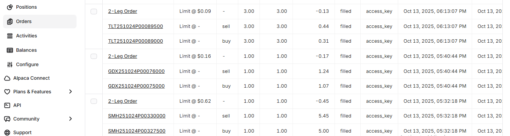

# 📘 Bull Put Spread Options Trading Strategy

**Prepared by:** Paul K. Mwangi  
**Prepared for:** Potential Investor  
**Date:** October 15, 2025  

---

## 🧭 Executive Summary

This document describes a professional, industry-standard implementation of a **Bull Put Spread algorithmic trading strategy**.  
The strategy targets consistent option premium income by selling out-of-the-money (OTM) put credit spreads on U.S. equities and ETFs.  
Positions are entered early in the trading week and managed for a short time horizon (typical holding period: **5 trading days**) with rigorous risk controls.

---

## 🎯 Strategy Overview

- **Objective:** Generate repeatable income with defined downside using Bull Put Spreads (credit spreads).  
- **Instruments:** U.S. equity and ETF options.  
- **Holding Period:** Short-term; primary cadence is **Monday entry → Friday exit (5-day cycle)**.  
- **Order Type:** Limit orders only; multi-leg order handling for clean fills.  
- **Universe:** Pre-screened bullish instruments based on liquidity and technical indicators.

---

## 🧮 Mathematical Framework & Payoff

A **Bull Put Spread** consists of:

- Sell 1 put at strike \( K_s \) (short put)  
- Buy 1 put at strike \( K_l < K_s \) (long put) to cap downside  

**Net credit at entry:**  
\( C = \text{premium}_{short} - \text{premium}_{long} \)

**Payoff at expiration \( S_T \):**

\[
\text{Profit}(S_T) = C - \max(K_s - S_T, 0) + \max(K_l - S_T, 0)
\]

**Key quantities:**
- Maximum Profit = **C** (credit received), realized if \( S_T ≥ K_s \)
- Maximum Loss = **(K_s - K_l) - C**, realized if \( S_T ≤ K_l \)
- Break-even = **\( K_s - C \)**

---

## ⚙️ Pricing & Greeks

Using the **Black-Scholes-Merton model** for European-style approximation:

\[
d_1 = \frac{\ln(S/K) + (r + 0.5σ^2)T}{σ\sqrt{T}}
\quad \text{and} \quad
d_2 = d_1 - σ\sqrt{T}
\]

We derive call and put prices from standard BSM formulas using market-implied volatility.  
Selection prioritizes:
- Delta (short put ≈ -0.08 to -0.15)  
- Theta (positive portfolio theta)  
- IV Rank (to ensure adequate premium)

---

## 💡 Illustrative Example: Payoff Diagram

*(Placeholder for payoff plot or visual if you wish to add one later.)*

---

## 💰 Illustrative Example Trade (Numbers)

| Parameter | Value |
|------------|--------|
| Underlying (S₀) | $100.00 |
| Short Put Strike (Kₛ) | $95.00 |
| Long Put Strike (Kₗ) | $90.00 |
| Short Premium (received) | $1.50 |
| Long Premium (paid) | $0.30 |
| **Net Credit (C)** | **$1.20** |
| **Max Profit** | **$1.20** |
| **Max Loss** | **$3.80** |
| **Break-even** | **$93.80** |

---

## 🧩 Operational Workflow

The algorithm executes the following workflow:
1. **Screen underlyings** based on liquidity, trend, and volatility metrics.  
2. **Filter option chains** for expiries 8–14 DTE and acceptable delta range.  
3. **Pair short and long puts** to form a valid Bull Put Spread.  
4. **Submit limit order** as a multi-leg (2-leg) trade.  
5. **Manage open spreads**: monitor P/L, exit near target profit or weekly deadline.  
6. **Roll or rinse logic**: automatically close and re-enter new spreads after exit.

---

## 🧠 Scoring, Selection & Risk Controls

**Scoring Heuristic (weights):**
- Technical Score (RSI, MACD, SMA, ADX): **35%**  
- Option Liquidity & Spread Width: **20%**  
- Implied Volatility & IV Rank: **20%**  
- Risk/Reward (Credit vs. width): **15%**  
- Diversification / Correlation impact: **10%**

**Risk Controls:**
- Always paired (no naked shorts).  
- Position sizing based on buying power & per-symbol allocation limit.  
- Forced weekly exits (avoid weekend gap risk).  
- All spreads tradable as clean 2-leg orders.  
- Full logging, order tracking, and reconciliation.

---

## 📊 Strategy Results

Below are snapshots from the **Alpaca Paper Trading dashboard** showing live trade outcomes:

### 💹 Portfolio Performance

### 📁 Positions Overview

### 📜 Orders Log

---

## 📎 Appendices & Assumptions

- U.S. options are **American-style**; BSM model used as approximation.  
- Execution differences due to **bid-ask spread**, **partial fills**, and **slippage** are expected.  
- Results reflect **paper trading environment**; performance may differ in live trading.

---

## Summary

The Bull Put Spread algorithm demonstrates:
- Defined risk, capped losses, and consistent premium income potential.  
- Robust technical and volatility-based screening.  
- Automated entry, exit, and roll management with Alpaca API integration.  

**Status:** Successfully tested on Alpaca Paper Account  
**Performance:** +5.82% portfolio gain (as of October 20, 2025)

---

